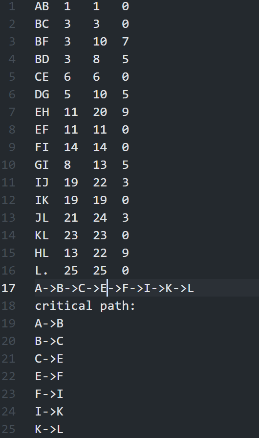

<<<<<<< HEAD:实验进展/lab4/lab4实验进展.md
### 实验四 过程记录及报告

实验内容：

 

### 1.关于XP开发方法，XP开发工作模型：

Extreme Programming (XP) 是一种敏捷软件开发方法，注重简单、灵活、高质量的软件开发。其核心理念是通过反复迭代、快速反馈、持续改进和高度合作来提高软件开发的效率和质量。

XP开发方法将开发阶段的四个活动（分析、设计、编码和测试）混合在一起，并在全过程中采用迭代增量开发、反馈修正和反复测试。

**XP过程工作模型主要包括以下几个关键实践：**

1)    用户故事（User Stories）：这是XP方法的核心，用户故事描述了软件系统的功能需求，从用户的视角来表达。这些故事通常以简短的形式写成，并被用来驱动开发过程。

2)    计划游戏（Planning Game）：这是XP方法中的一项重要实践，团队成员通过计划游戏共同决定下一个迭代要完成的用户故事。这个过程包括估算用户故事的工作量、优先级排序和分配迭代周期等。

3)    持续集成（Continuous Integration）：XP方法强调持续集成，即频繁地将代码集成到主分支中，以确保软件始终处于可工作状态。这有助于及早发现和解决集成问题。

4)    小步快跑（Small Releases）：XP方法鼓励以小步快跑的方式进行软件开发，即频繁地发布小版本，以便及时获取用户反馈并进行调整。

 

### 2.阅读DevOps文档，了解DevOps

**DevOps 的特点和关键概念：**

1)    协作和沟通：DevOps强调开发团队和运维团队之间的紧密合作和沟通，通过打破“信息孤岛”来实现团队的协同工作。

2)    自动化：自动化是DevOps的核心原则，包括自动化部署、自动化测试、自动化监控等，以实现持续交付和持续集成。

3)    持续交付：DevOps倡导持续交付和部署，通过快速迭代、快速反馈的方式提高软件交付的速度和质量。

4)    监控和反馈：通过实时监控系统运行状态和用户反馈，及时调整和优化软件系统。

5)    容器化和微服务：DevOps通常采用容器化和微服务架构，以提高部署的灵活性、可移植性和扩展性。

6)    持续集成和持续部署：通过持续集成和持续部署实现自动化构建、集成和部署代码，减少人为干预和错误。

**DevOps 的优势和目标：**

1)    加速软件交付：通过自动化流程和持续交付，缩短软件开发到部署的时间。

2)    提高稳定性和质量：通过自动化测试、监控和反馈机制，提高软件系统的稳定性和质量。

3)    降低成本：通过自动化和标准化流程，减少人为操作和资源浪费，降低软件开发和运维成本。

4)    增强团队合作和创新：促进开发和运维团队之间紧密合作，激发创新和协同精神。

 

 

### 3.练习 

  书上练习题2,3（p97-98) 的软件开发项目活动图，找出关键路径-，作答如下：

 

**练习2的作答：**

  

**练习3的作答：**

### 3.小组讨论，

针对自己项目中的工作进行工作活动分解，分工进行各自合理的工作进度估算，最后汇总绘出项目活动图，找出关键路径。（单独提交）

 

 

 

 
=======
### 实验四 过程记录及报告

实验内容：

 

### 1.关于XP开发方法，XP开发工作模型：

Extreme Programming (XP) 是一种敏捷软件开发方法，注重简单、灵活、高质量的软件开发。其核心理念是通过反复迭代、快速反馈、持续改进和高度合作来提高软件开发的效率和质量。

XP开发方法将开发阶段的四个活动（分析、设计、编码和测试）混合在一起，并在全过程中采用迭代增量开发、反馈修正和反复测试。

**XP过程工作模型主要包括以下几个关键实践：**

1)    用户故事（User Stories）：这是XP方法的核心，用户故事描述了软件系统的功能需求，从用户的视角来表达。这些故事通常以简短的形式写成，并被用来驱动开发过程。

2)    计划游戏（Planning Game）：这是XP方法中的一项重要实践，团队成员通过计划游戏共同决定下一个迭代要完成的用户故事。这个过程包括估算用户故事的工作量、优先级排序和分配迭代周期等。

3)    持续集成（Continuous Integration）：XP方法强调持续集成，即频繁地将代码集成到主分支中，以确保软件始终处于可工作状态。这有助于及早发现和解决集成问题。

4)    小步快跑（Small Releases）：XP方法鼓励以小步快跑的方式进行软件开发，即频繁地发布小版本，以便及时获取用户反馈并进行调整。

 

### 2.阅读DevOps文档，了解DevOps

**DevOps 的特点和关键概念：**

1)    协作和沟通：DevOps强调开发团队和运维团队之间的紧密合作和沟通，通过打破“信息孤岛”来实现团队的协同工作。

2)    自动化：自动化是DevOps的核心原则，包括自动化部署、自动化测试、自动化监控等，以实现持续交付和持续集成。

3)    持续交付：DevOps倡导持续交付和部署，通过快速迭代、快速反馈的方式提高软件交付的速度和质量。

4)    监控和反馈：通过实时监控系统运行状态和用户反馈，及时调整和优化软件系统。

5)    容器化和微服务：DevOps通常采用容器化和微服务架构，以提高部署的灵活性、可移植性和扩展性。

6)    持续集成和持续部署：通过持续集成和持续部署实现自动化构建、集成和部署代码，减少人为干预和错误。

**DevOps 的优势和目标：**

1)    加速软件交付：通过自动化流程和持续交付，缩短软件开发到部署的时间。

2)    提高稳定性和质量：通过自动化测试、监控和反馈机制，提高软件系统的稳定性和质量。

3)    降低成本：通过自动化和标准化流程，减少人为操作和资源浪费，降低软件开发和运维成本。

4)    增强团队合作和创新：促进开发和运维团队之间紧密合作，激发创新和协同精神。

 

 

### 3.练习 

  书上练习题2,3（p97-98) 的软件开发项目活动图，找出关键路径-，作答如下：

 

**练习2的作答：**

  

**练习3的作答：**

### 3.小组讨论，

针对自己项目中的工作进行工作活动分解，分工进行各自合理的工作进度估算，最后汇总绘出项目活动图，找出关键路径。（单独提交）

 

 

 

 
>>>>>>> 81cddbfb02c0f9d0b5296ae4c2f3d8dc96c9dba1:实验进展/第五周实验进展.md
